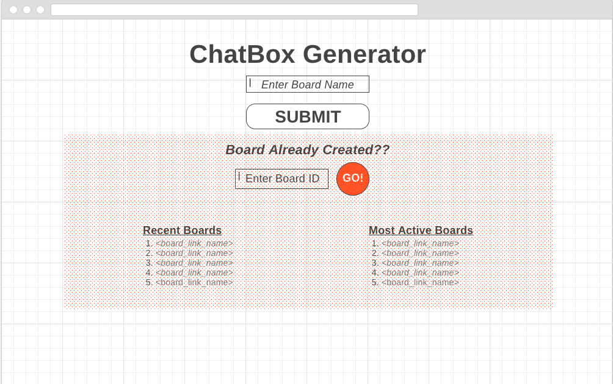

# ChatBox Generator

>[TrelloBoard/ UserStories](https://trello.com/b/qagfdMSe/fullstackproject1)  
>[ERD](https://drive.google.com/file/d/0B4r4a7ZMDOu_R2x1bUZFUzI1aDQ/view?usp=sharing)  
>[GIT](https://github.com/uniOpifex/ChatBoxGenerator) 

### Wireframe Pages: 
* [Landing Page](https://wireframe.cc/oU5r1V)
* [Board :Reach:](https://wireframe.cc/ceMvIt)
* [Board :Stretch:](https://wireframe.cc/w8q3u6) 
* [Make a new Board/Thread](https://wireframe.cc/MpxTjS)

### Reach:

App will be forum generator  
User can create Thread and commit comments to those threads

Four Models

Boards
Thread
Posts
Users

* BOARDS can be viewed(GET), create(POST), edited(PUT), and(Delete) by user

* POSTS can be viewed(GET),create(POST),edited(PUT),and(Delete)?maybe? by user  

* Users. Can be viewed(GET),create(POST),edited(PUT),and(Delete) by user 

### Stretch

App will transform into a chat box generator.  
Requires updating page without refreshing page

### --Additional Resources  
>[markdown editor](https://jbt.github.io/markdown-editor/)

### Views

Landing page with stretch:

Board Reach Goal

Board Stretch Goal

